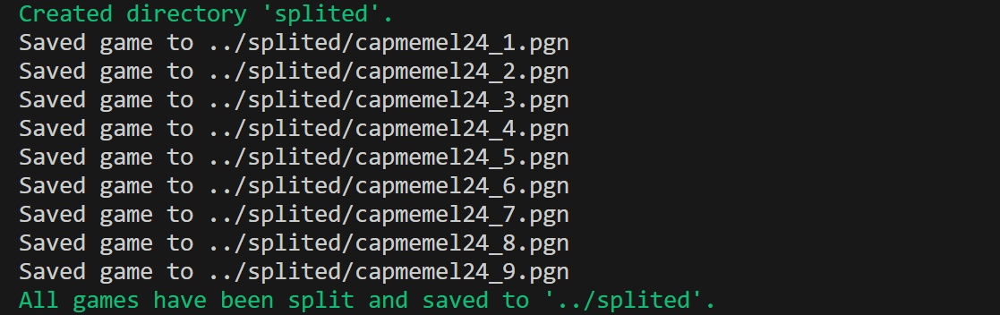

  


# PGN Splitter ♟️

📂 A Bash script that splits chess PGN files into individual game files

## Table of Contents

1. [About](#about)  
2. [Features](#features)  
3. [Requirements](#requirements)  
4. [Installation](#installation)  
5. [Usage](#usage)  

---

## About

This repository contains a small project for splitting PGN (Portable Game Notation) files into individual chess games.  
The project reads a single PGN file containing multiple games and outputs each game as a separate PGN file in a specified folder.  
It demonstrates basic file handling, string processing, and scripting in Bash, with informative messages printed during execution.

---

## Features

- Splits a PGN file containing multiple chess games into individual files  
- Automatically creates the destination directory if it doesn't exist  
- Prints informative messages when each game is saved  
- Handles empty lines to detect game boundaries  
- Simple and easy-to-use Bash script

---

## Requirements

- A Linux, macOS, or Windows system with Bash  
- PGN files containing chess games
- Git (to clone the repository) 

---

## Installation

Follow these steps to set up the project locally:

---

### 1. Clone the repository
```bash
git clone https://github.com/Amit-Bruhim/PGN-Splitter.git
```
### 2. Navigate into the src folder
```bash
cd PGN-Splitter/src
```
### 3. Run the script

To split a PGN file, run the script with the following arguments:  

```bash
./split_pgn.sh <source_pgn_file> <destination_directory>
```

---

## Usage

After running the script, it will execute automatically without user interaction, printing details about its progress.  
For each game saved, a message will be displayed, and if a new directory is created, it will also be indicated.  
At the end, a completion message will confirm that all games have been split and saved.  

If an error occurs (e.g., missing arguments), an error message will be printed.

For example, using the PGN file `../pgn_examples/capmemel24.pgn` and the directory `splited`, the output when running the script from `src` will look like this:



For user convenience, the `pgn_examples` directory contains an example of an un-split PGN file (`capmemel24.pgn`) so you can test the script immediately.  
To test the script, navigate into the `src` directory and run the following command:

```bash
./split_pgn.sh ../pgn_examples/capmemel24.pgn splited_pgn
```

